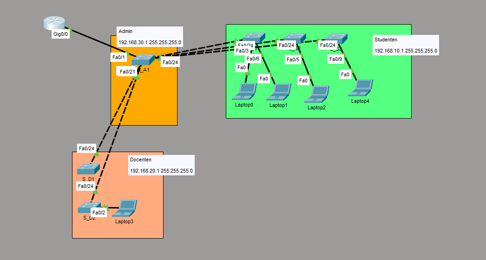

# Packet Tracer: Router-on-a-Stick (Inter-VLAN Routing)

## 1\. Project Overview

This project demonstrates a network where different departments (VLANs) are separated at Layer 2 (Switching), but can communicate with each other via a Layer 3 device (Router). This concept is called **Router-on-a-Stick**.

The router uses a single physical link to process traffic for multiple VLANs by utilizing **802.1Q Encapsulation** (trunking).

## 2\. Network Topology

The network is divided into three logical groups:

  * **Students (VLAN 10):** Green zone.
  * **Teachers (VLAN 20):** Orange zone.
  * **Admin/Management (VLAN 30):** Central zone.



To understand how the router separates traffic for different VLANs over a single cable, view the visualization of the process below:

## 3\. VLAN & Addressing Schema

| Group | VLAN ID | Network | Subnet Mask | Default Gateway |
| :--- | :--- | :--- | :--- | :--- |
| **Students** | 10 | 192.168.10.0 | 255.255.255.0 | 192.168.10.1 |
| **Teachers** | 20 | 192.168.20.0 | 255.255.255.0 | 192.168.20.1 |
| **Admin** | 30 | 192.168.30.0 | 255.255.255.0 | 192.168.30.1 |

## 4\. Configuration Details

### A. Router Configuration (Gateway)

The router has no IP address on the physical interface (`GigabitEthernet0/0`). Instead, **Sub-interfaces** are created. Each sub-interface acts as the gateway for a specific VLAN.

**Key Commands:**

```bash
interface GigabitEthernet0/0.10
 encapsulation dot1Q 10        ! Maps this to VLAN 10 tag
 ip address 192.168.10.1 255.255.255.0

interface GigabitEthernet0/0.20
 encapsulation dot1Q 20        ! Maps this to VLAN 20 tag
 ip address 192.168.20.1 255.255.255.0

interface GigabitEthernet0/0.30
 encapsulation dot1Q 30        ! Maps this to VLAN 30 tag
 ip address 192.168.30.1 255.255.255.0
```

### B. Switch Configurations

There are three different switch roles in this topology:

1.  **Student Switch (Access Layer):**

      * Ports `Fa0/1` to `Fa0/23` are in **Access Mode** for VLAN 10.
      * The uplink to the central switch (`Fa0/24`) is a **Trunk**.
      * *Config:* `switchport access vlan 10`.

2.  **Teacher Switch (Access Layer):**

      * Ports `Fa0/1` to `Fa0/23` are in **Access Mode** for VLAN 20.
      * The uplink to the central switch (`Fa0/24`) is a **Trunk**.
      * *Config:* `switchport access vlan 20`.

3.  **Central/Distribution Switch:**

      * This switch connects the Access switches and the Router.
      * Ports `Fa0/20` to `Fa0/24` are configured as **Trunks**.
      * A filter is applied to allow only the necessary VLANs: `switchport trunk allowed vlan 10,20,30`.

## 5\. Verification

To test if the configuration is working:

1.  Assign a PC in VLAN 10 the IP `192.168.10.10` (Gateway `192.168.10.1`).
2.  Assign a PC in VLAN 20 the IP `192.168.20.10` (Gateway `192.168.20.1`).
3.  Open the Command Prompt on the Student PC and type:
      * `ping 192.168.10.1` (Test connection to Gateway)
      * `ping 192.168.20.10` (Test connection to Teacher network)

If the pings are successful, the **Inter-VLAN routing** is working correctly.
